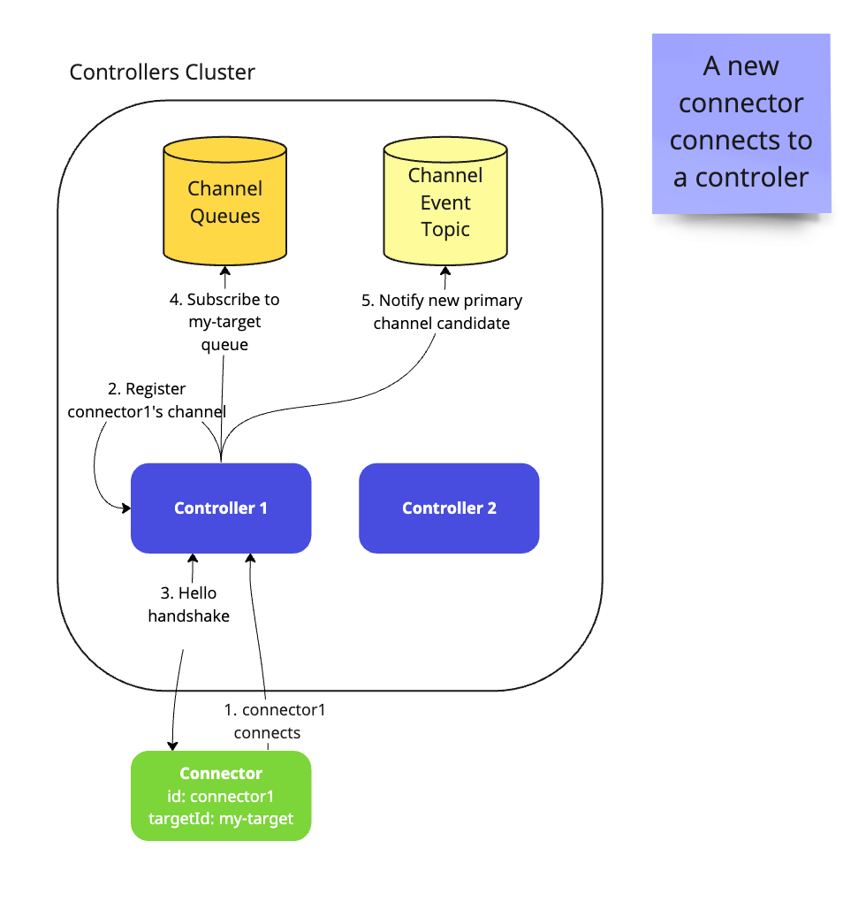
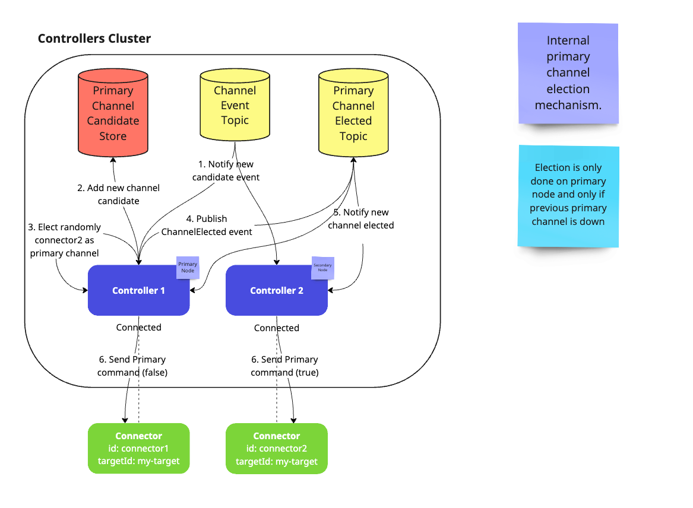
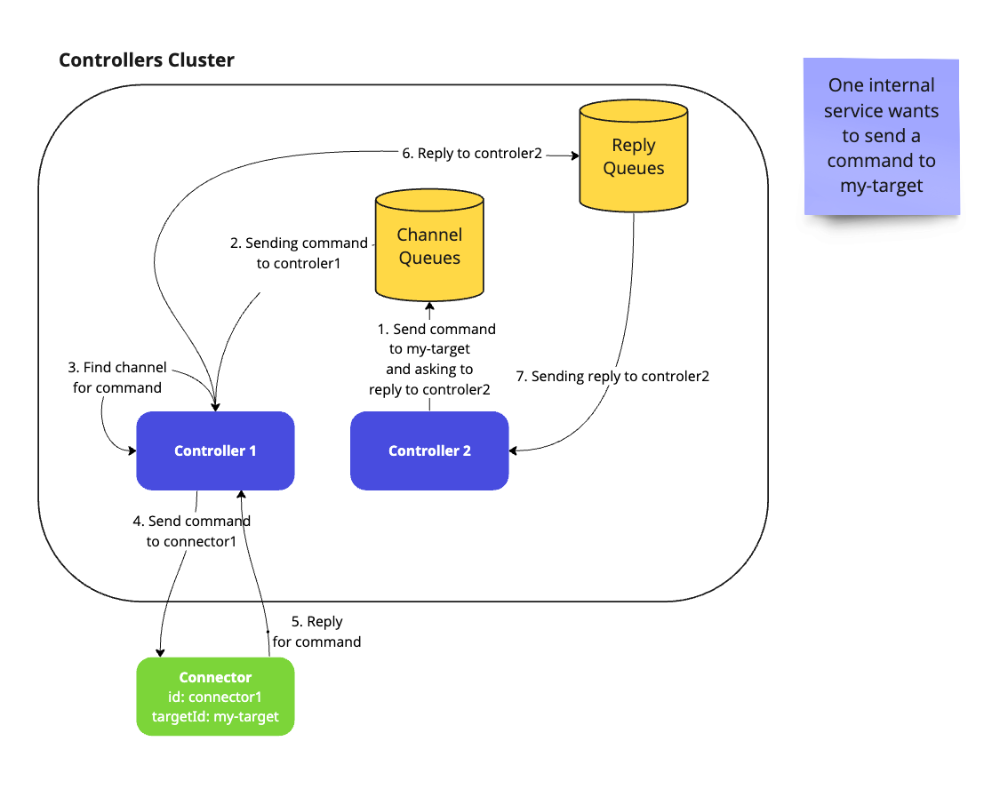
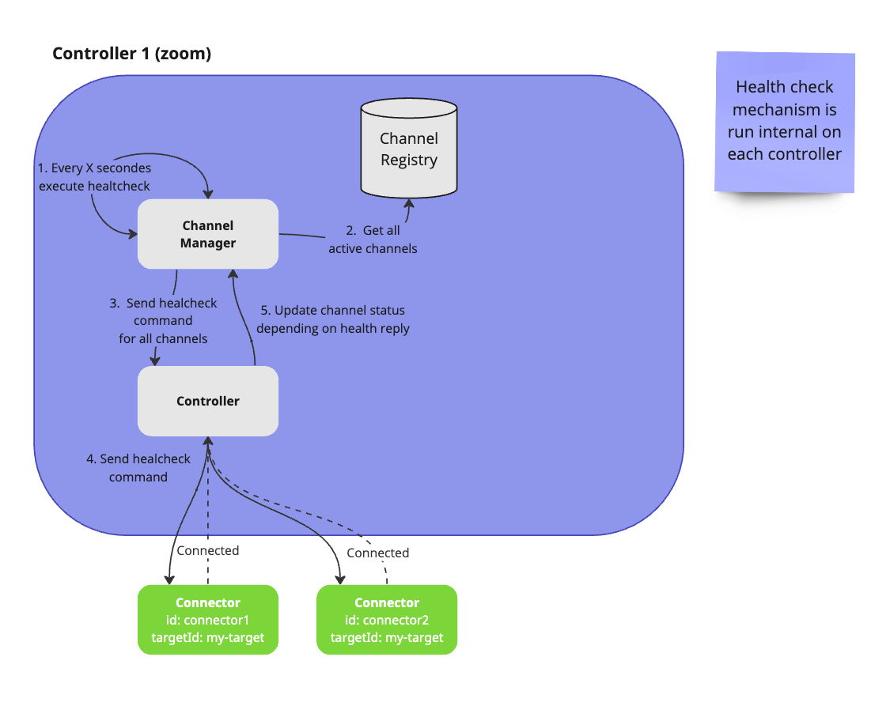

= Gravitee.io - Command-Reply Exchange Framework

== Description
The command-reply exchange framework offers a generic mechanism to exchange commands and replies between two components called Controller and Connectors.

== Overview
=== Connector
A connector is identified by its id and its target-id. In order to scale connectors, connectors can be attached to the same target-id. The connector is managed by a controller.
A Connector allows to send command to the controller.

=== Controller
A controller is the component where connectors can connect to. It will manage connectors life-cycle based health check, and primary election. Controllers work in cluster based on ClusterManager service offered by https://github.com/gravitee-io/gravitee-node/tree/master/gravitee-node-cluster[gravitee-node].
A controller allows to send commands and batches to a connector via its target-id.

=== Channel
A channel is a way to exchange commands and replies between a connector and a controller. There is always a connector view and a controller view of the same channel. A channel can be embedded when both controller and connectors run on the same JVM or could represent a network when they are remote.

=== Commands
A command is a json payload send to a channel. For any commands a reply is expected.

=== Workflow
Bellow you could find advanced details on different connector<>controller workflows.

==== Registration
This is the first required step to allow connectors and controllers to exchange commands. The diagram bellow describes how a connector establishes the connection and how the controller registers it.

==== Primary channel election
The primary channel election is used in order to avoid cluster management on the connectors side. A channel get notified it is primary thanks to a specific command. Then, it can e.g. start a scheduled process to send the controller some specific commands. Note that primary and secondary channels can still be used to send and receive commands and replies, this mechanism exists so that a connector bound to the primary channel is responsible to send commands that no other connector is allowed to send.

==== Sending command
A command is the way to communicate between a connector and a controller. The schema bellow explain the various steps its processing involves.

==== Health check mechanism
The purpose of health check is to verify that the connector is still properly working and able to receive commands, at network level and also at the business logic level. The connector can do business check to ensure it can react on any commands.

== Management API
By default, when a controller is created it will register endpoints on the Node Management API. See https://github.com/gravitee-io/gravitee-node/blob/master/README.adoc#management.

The endpoints are the following, where `[identifier]` is optional and will be your controller identifier:

    - `/exchange/[identifier]/targets`: return metrics information on channels and batchs grouped by target.
    - `/exchange/[identifier]/targets/:id`: return metrics information on channels and batchs for the given target.
    - `/exchange/[identifier]/targets/:id/channels`: return metrics information on channels for the given target.
    - `/exchange/[identifier]/targets/:id/batchs`: return metrics information on batchs for the given target.
    - `/exchange/[identifier]/batchs`: return metrics information on batchs. Can be filtered by `status` and `targetId`.
    - `/exchange/[identifier]/batchs/:id`: return metrics information for the given batch.
    - `/exchange/[identifier]/channels`: list channels. Can be filtered by `active` status and `targetId`.
    - `/exchange/[identifier]/channels/:id`: return metrics information for the given channel.

=== Deactivation

This behavior can be disabled by settings the following property `[identifier].controller.management.enabled` to `false`. The `[identifier]` is your controller identifier or `exchange` by default.